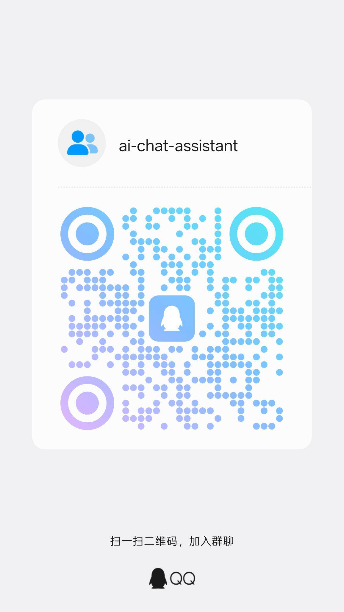

# AI 聊天助手

<p align="center">
  
</p>

<p align="center">
  <b>扫码加入交流群</b>
</p>

一款 Windows 电脑端 AI 聊天助手软件，能够接管微信/QQ 应用的聊天窗口，基于用户以往的聊天习惯自动生成回复内容。

## ✨ 功能特性

### 🤖 多模型支持
- OpenAI (GPT-4o, GPT-4.1 等)
- Anthropic Claude (Claude Sonnet 4, Claude 3.5 等)
- DeepSeek (DeepSeek-V3, DeepSeek-R1)
- 通义千问 (qwen-turbo, qwen-plus, qwen-max)
- Moonshot Kimi (moonshot-v1-8k, 32k, 128k)
- 小米 MiMo (mimo-v2.5-pro 等)
- 自定义 OpenAI 兼容接口

### 💬 消息平台接入
- **微信 PC 端** - 通过 WeChatFerry 接入（开发中，等待支持微信4.x）
- **QQ PC 端** - 通过 NapCat 接入（基于 NTQQ 协议）

### 🎯 智能功能
- **AI 自动回复** - 基于上下文和用户风格生成回复
- **聊天风格学习** - 从历史聊天记录中学习用户说话习惯
- **策略控制** - 按联系人/群组粒度控制自动回复
- **回复审核队列** - 支持人工确认后发送
- **打字延迟模拟** - 模拟人类打字速度

### 🔒 安全隐私
- 本地数据加密存储
- API Key 安全保护
- 敏感信息脱敏
- 启动密码保护

## 🚀 快速开始

### 前置要求

- Node.js 20+ 或 22+
- pnpm 9+（推荐）或 npm
- Git

### 安装

```bash
# 克隆仓库
git clone https://github.com/your-username/ai-chat-assistant.git
cd ai-chat-assistant

# 安装依赖
npm install

# 启动开发服务器
npm run dev
```

### 启动应用

```bash
# 方式一：使用启动脚本（推荐）
# 双击 start.bat

# 方式二：手动启动
# 终端1：启动 Vite 开发服务器
npm run dev

# 终端2：启动 Electron 窗口
set ELECTRON_RENDERER_URL=http://localhost:5173
npx electron .
```

## ⚙️ 配置说明

### 1. 配置 AI 模型

1. 打开应用，点击左侧"模型配置"
2. 点击"添加模型"按钮
3. 选择提供商（如 OpenAI、MiMo 等）
4. 填入 API Key 和其他配置
5. 点击"测试连接"验证
6. 保存配置

#### MiMo Token Plan 配置示例

| 配置项 | 值 |
|--------|-----|
| 提供商 | 小米MiMo |
| 名称 | MiMo官方 |
| API Key | 你的 Token Plan API Key (tp-xxx) |
| API端点 | https://token-plan-cn.xiaomimimo.com/v1/chat/completions |
| 默认模型 | mimo-v2.5-pro |

### 2. 配置 QQ（通过 NapCat）

1. 下载 [NapCatQQ](https://github.com/NapNeko/NapCatQQ/releases)
2. 运行 NapCatInstaller.exe 安装
3. 登录 QQ
4. 在应用中点击"QQ设置"
5. 填入 NapCat HTTP 端口（默认 3000）
6. 点击"连接QQ"

### 3. 配置微信（通过 WeChatFerry）

> ⚠️ 微信接入功能开发中，等待 WeChatFerry 支持微信 4.x 版本

1. 下载 [WeChatFerry](https://github.com/lich0821/WeChatFerry/releases)
2. 安装配套微信版本
3. 在应用中点击"微信设置"
4. 点击"连接微信"

## 📁 项目结构

```
ai-chat-assistant/
├── electron/                    # Electron 主进程
│   ├── main.ts                  # 主进程入口
│   ├── preload.ts               # 预加载脚本
│   └── services/                # 核心服务
│       ├── database/            # 数据库服务
│       ├── model-adapter/       # 模型适配层
│       ├── wechat/              # 微信服务
│       └── qq/                  # QQ 服务
├── src/                         # React 渲染进程
│   ├── App.tsx                  # 应用入口
│   ├── pages/                   # 页面组件
│   │   ├── Dashboard/           # 控制面板
│   │   ├── ChatMonitor/         # 聊天监控
│   │   ├── ModelConfig/         # 模型配置
│   │   ├── WeChatSettings/      # 微信设置
│   │   ├── QQSettings/          # QQ设置
│   │   └── Settings/            # 系统设置
│   ├── components/              # 公共组件
│   ├── stores/                  # 状态管理
│   └── utils/                   # 工具函数
├── data/                        # 运行时数据（不上传）
├── package.json
├── tsconfig.json
├── vite.config.ts
└── start.bat                    # 启动脚本
```

## 🛠️ 技术栈

| 类别 | 技术 |
|------|------|
| 前端框架 | React 19 + TypeScript |
| UI 组件库 | Ant Design 5 |
| 状态管理 | Zustand |
| 样式方案 | TailwindCSS 4 |
| 构建工具 | Vite 6 |
| 桌面框架 | Electron |
| 数据库 | SQLite (sql.js) |
| AI SDK | 原生 fetch + 自定义适配器 |

## 📝 开发

```bash
# 安装依赖
npm install

# 启动开发服务器
npm run dev

# 代码检查
npm run lint

# 类型检查
npm run typecheck

# 运行测试
npm run test:unit

# 构建应用
npm run build
```

## 🤝 贡献

欢迎提交 Issue 和 Pull Request！

## 📄 许可证

MIT License

## ⚠️ 免责声明

本项目仅供学习研究使用，请勿用于非法用途。使用第三方工具接入社交平台需遵守相关平台的服务条款和当地法律法规。

## 🔗 相关链接

- [WeChatFerry](https://github.com/lich0821/WeChatFerry) - 微信消息收发框架
- [NapCatQQ](https://github.com/NapNeko/NapCatQQ) - QQ Bot 框架
- [MiMo API](https://mimo.mi.com/) - 小米 MiMo API 平台
